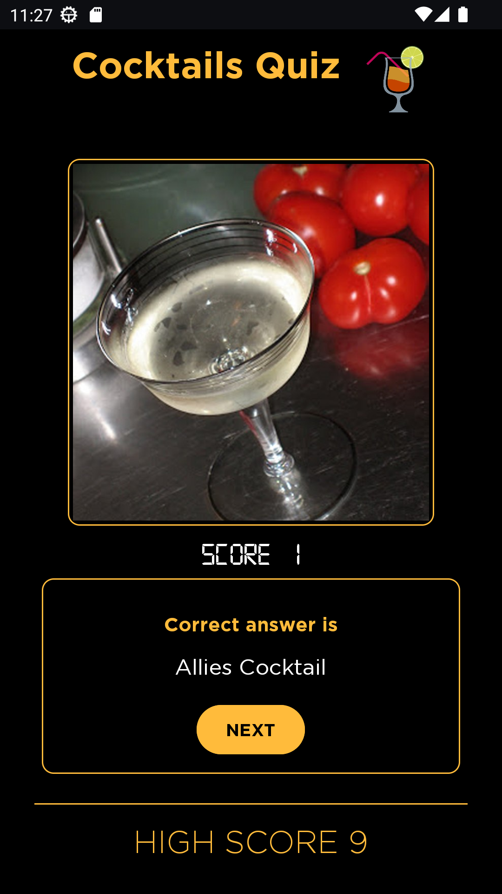

<a name="readme-top"></a>
# Cocktails Quiz
[](https://github.com/KotlinBy/awesome-kotlin)

Cocktails Quiz test your alcohol knowledge ...

* This is just a fun app to get familiar with cocktails around the world. Cheers!
* After answering all the questions successfully again and again, you will be an expert alcoholic ;)
* Made with ❤️ to expose my coding style and CLEAN architecture pattern.


## Built using
1) Kotlin
2) Generics
3) HILT2
4) Retrofit
5) Shared Preference
6) Navigation Component


## App Architecture
The code is divided in to five layers of CLEAN Architecture Pattern.

<b>1. Presentation.</b><br>
<b>2. Use cases.</b><br>
<b>3. Domain.</b><br>
<b>4. Data.</b><br>
<b>5. Framework.</b><br>


## Screenshot

<a href="https://github.com/harshaltilay/CocktailQuiz">
    
</a>

## Apk download
<a href="https://github.com/harshaltilay/CocktailQuiz/raw/master/CocktailsQuiz.apk">
Download the apk to see it in action
</a>

<!-- CONTACT -->
## Developer Info
Name: Harshal Tilay</br>
Country: India (GMT+5.30)</br>

## Disclaimer
This is my hobby project mostly completed in spare time and has been developed on Emulator only. If you face any issue please let me know further.
This is an offline app so if you uninstall it then you will loose all your existing data.
<p align="right">(<a href="#readme-top">back to top</a>)</p>

### License
```
   Copyright (C) 2023 HARSHAL TILAY

   Licensed under the Apache License, Version 2.0 (the "License");
   you may not use this file except in compliance with the License.
   You may obtain a copy of the License at

       http://www.apache.org/licenses/LICENSE-2.0

   Unless required by applicable law or agreed to in writing, software
   distributed under the License is distributed on an "AS IS" BASIS,
   WITHOUT WARRANTIES OR CONDITIONS OF ANY KIND, either express or implied.
   See the License for the specific language governing permissions and
   limitations under the License.
```
<p align="right">(<a href="#readme-top">back to top</a>)</p>